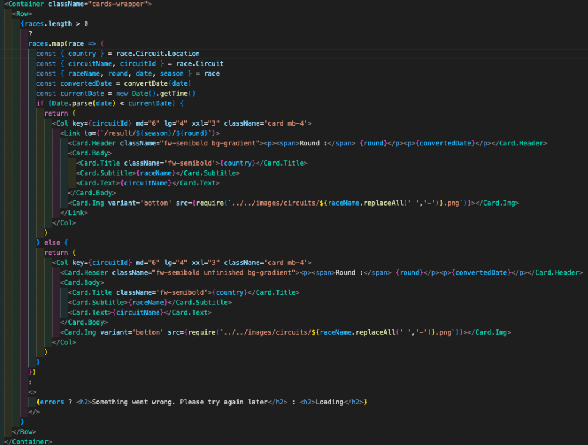

# SEI - Project Two - Formula 1

## Table of contents

* Project Overview
* The Brief
* Technologies Used
* Approach Taken (featured code)
* Final Product (screenshot walkthrough)
* Wins & Challenges
* Bugs
* Future Content and Improvements
* Key Learnings

## Project Overview
Our second project at General Assembly, “React Hackathon”, was a pair project where we were expected to build a React application which consumed a public API and used RESTful methods in 48 hours. 

The idea of our App is to provide Formula 1 race schedule and results, standings and Driver profiles for the current season.  

**Coding Partner**: Fasai Chunchuasuparerk ([Github](https://github.com/fasaic))

***

#### You will find the deployed app here: [https://sei-project2-formula1.netlify.app](https://sei-project2-formula1.netlify.app)

***

### Code Installation
Clone or download the repo then do the following in Terminal:
* Install Yarn in terminal with command: `yarn install`
* Start server with terminal command: `yarn run start`

## The Brief

The App should:
* Consume a public API
* Have several components
* Include a router - with several “pages”
* Include wireframes - that you designed before building the app
* Be deployed online and accessible to the public

## Technologies Used

#### Frontend:
* JavaScript (ES6)
* React
  * react-router-dom
  * react-bootstrap
* Axios
* HTML
* SCSS & Bootstrap

#### Development tools:
* VS Code
* yarn
* Insomnia
* Git & Github
* Google Chrome dev tools
* Netlify (deployment)
* Excalidraw (wireframing)

## Approach taken (featured code)

We started by reviewing a long list of public APIs across many different themes and topics. We bounced ideas off each other as we went along and after making a shortlist of three APIs and reviewing the documentation we agreed upon an F1 related App. Like many, I became an F1 fan after watching Drive to Survive during Lockdown One (April 2020) so I was excited to dig into the data and get started.

We had a rough idea of the pages we wanted to produce so we checked all the available end-points in Insomnia, explored and noted down the routes to accessing the datasets we needed and settled on the two end-points we would be using for the project. We knew our chosen API didn’t provide images so we sourced another API which could provide this - this came with a few difficulties which are detailed in the Challenges section. 

Whilst we divided up the Components to work on - Schedule, Drivers and Driver Profile pages for me and Home Page (Standings), Race Results and NavBar for Fasai - we were often jumping into help each other other if we got stuck and Fasai was a great help when it came to styling as I found (React) Bootstrap particularly challenging. 

This was my first time pair programming and I really enjoyed working alongside someone else in a team. It not only made the long days far more enjoyable but I learnt a huge amount from Fasai in such a small amount of time. The communication between us was great, we knew which parts the other was working on, what stage we were at and what we needed to do next at all times. This was helped by being highly organised, having a detailed plan of execution, and setting ourselves daily goals. 

### Planning 

Once we decided on the concept, we planned the features for the app: 

* Homepage with the current driver standings - driver name is clickable and will take the user through to the the correspondingly Driver Profile page
* Schedule page listing all races in the season - past races are clickable and will take the user through to the individual race results page
* Race Results page
* Index of Driver Profiles
* Single Driver Profile pages with bio (name, nationality, date of birth) and current stats (position, points, wins)

We then wireframed each page using Excalidraw.

**Homepage - Current Standings**

**Schedule**

**Race Result**

**Driver Index**

**Driver Profile**

*** 

As this was our first joint project, we decided to spend the days on Zoom together and live share our VS Code. This meant that we were on hand to help each other out and avoid any merge conflicts (we had a short space of time to build the app and as neither of us had any experience managing merge conflicts we thought best save that for the next project when we had a more time!). It was also nice to have company!

### Featured Code

**Race Schedule** 

We wanted previous races to be clickable and take the user to the individual race results so we added conditional logic that would check whether the date/time of the race (in our fetched data) was before the current date/time. We used the getTime() method for the current time and Date.parse for the time of the race, both returning time in milliseconds which we could then use in our conditional logic statement. 

 

**Single Race Result**

We used the React Bootstrap Grid system to create our Standings and Single Result tables.

 

## Final Project (screenshot walkthrough)

**Homepage - Current Standings**

**Schedule**

**Race Result**

**Driver Index**

**Driver Profile**

## Wins & Challenges

**Wins**: 
* I think we managed to achieve a lot in the small space of time we had and I’m happy with both the functionality and styling.
* We put a lot of time into making our App fully responsive to screen size and I’m pleased with how it turned out.
* The project was invaluable in terms of pair programming and being able to share and learn with my teammate.

**Challenges**:

* API Images 
  * The API we chose was publicly available, with no key/authorisation required and no rate limit. The only data the API was missing were images of the circuits and drivers. We found another API with images and we were able to use this successfully to pull in the images on the single Driver Profile pages. However, due to the end point requirements for this API, we weren’t able to use the API to pull in the images on the Schedule and Drivers Index page and instead had to save all the images on file. 
  * We did think of a solution in the final hour, but it was quite a long-winded solution and we didn’t have enough time to implement it. The solution involved fetching the driver details from our original API, another useEffect that would be triggered once this data was fetched and which would map through this data and trigger a separate function (let’s call it getDriverImage) that passes through the driver details we are mapping through and make a get request to our second API to fetch the driver images. This function would return a new object with the driver details (that we had passed through) and the driver image from the second API. This would be saved to a variable which would subsequently be set to a driverDetails state. 
  * Our second hurdle was the rate limit on our second API; in order to prevent rate limiting, we thought about setting a unique key (for each driver) to local storage; the value of this key would be a stringified version of the object returned by the getDriverImage function. If the key didn’t exist in local storage, the getDriverImage would be triggered and the key name and key value set to local storage. If the key existed in local storage, we would skip the getDriverImage function, and we would use the key, converting its value (in string format) back into an object and saving it to the aforementioned variable that is set to the driverDetails state.

* React Bootstrap 
  * We were introduced to React Bootstrap three days prior to starting the project and I was still very much getting to grips with it when we started the project. Bootstrap was very effective when creating Cards for the Schedule and Drivers pages, however, as I wasn’t well versed in the framework’s intricacies, I spent the majority of my time on the project styling. The fact that we wanted to produce a responsive App that would render well across all devices added another step to the styling which I found challenging and time consuming - there was a lot of trial and error! - however, it was worth the pain! I can see now that they have powerful, and very useful, features for making a website responsive and can be a simple and very effective way of displaying content.
 
## Bugs

**Images**
 * Due to the way we are displaying images for the driver index profile, if there are any new drivers which we don't have images for, the driver index page will break.

## Future Content and Improvements

* Implement a Search Bar for the Drivers Index Page
* Use the API to get the images for the Schedule & Driver Index Page. 
* Add more profile data to the Driver Profile page such as total number of “Did not finish (DNF)”, number of Fastest Lap wins and more. 

## Key Learnings

* This was my first project working with someone else and it was a wonderful experience. I really enjoyed working with someone who was working towards the same goal and could problem solving together. I found having someone to bounce ideas off of and explain my thought process to meant I had to think more about the way I was doing things and resulted in a better understanding of the code I needed to write and ultimately, a better app. 

